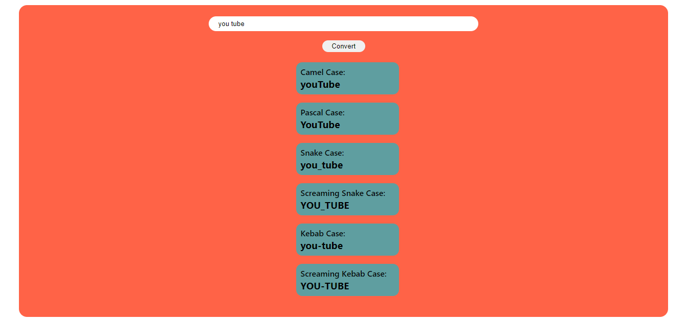
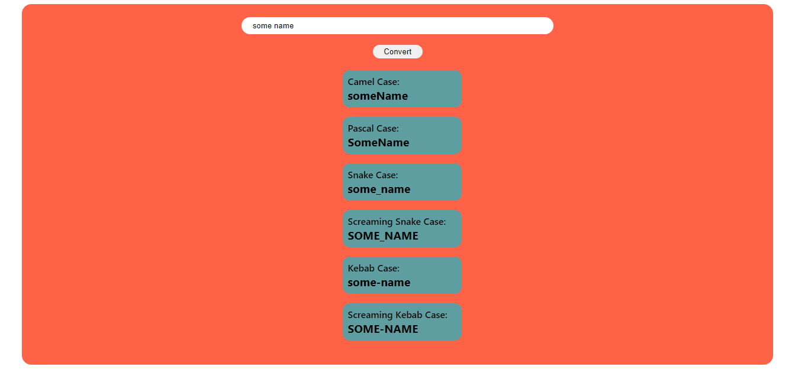

# PRANAV MATHUR

## Learnings from the project:

- String methods like _toUpperCase_ and _toLowerCase_

## Time taken:

    It took me 30 minutes to complete this project.

## Screenshots:

## Live link:

[Go to site](https://02-name-conversion.netlify.app/)
